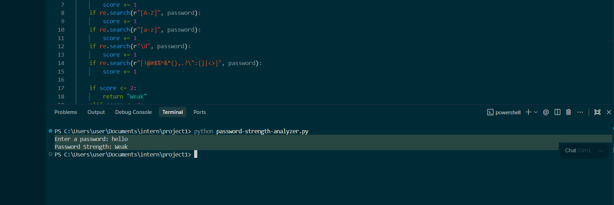
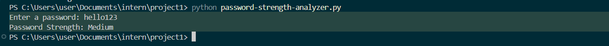
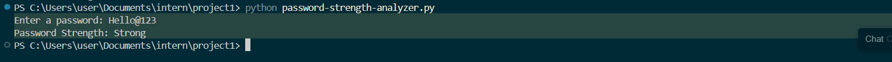

#  Password Strength Analyzer

A Python-based Password Strength Analyzer that evaluates the strength of a password based on common security criteria such as length, uppercase letters, lowercase letters, numbers, and special characters.

##  Features

- Checks password length
- Detects uppercase letters
- Detects lowercase letters
- Detects numeric digits
- Detects special characters
- Classifies passwords as:
  - Weak
  - Medium
  - Strong

##  Technologies Used

- Python 3
- Regular Expressions (`re` module)

##  How It Works

The program assigns a score based on the following criteria:

| Criteria | Points |
|----------|---------|
| Length ≥ 8 characters | 1 |
| Contains uppercase letter | 1 |
| Contains lowercase letter | 1 |
| Contains number | 1 |
| Contains special character | 1 |

### Strength Levels

| Score | Strength |
|---------|---------|
| 0–2 | Weak |
| 3–4 | Medium |
| 5 | Strong |

##  Installation & Usage

1. Clone the repository

```bash
git clone https://github.com/your-username/password-strength-analyzer.git
```

2. Navigate to the project folder

```bash
cd password-strength-analyzer
```

3. Run the program

```bash
python password-strength-analyzer.py
```

##  Example Output

### Weak Password

```text
Enter a password: hello
Password Strength: Weak
```

### Medium Password

```text
Enter a password: Hello123
Password Strength: Medium
```

### Strong Password

```text
Enter a password: Hello@1234
Password Strength: Strong
```

##  Screenshots

Add screenshots of:
- Weak password result
- Medium password result
- Strong password result

Example:







##  Learning Outcomes

Through this project, I learned:

- Password security fundamentals
- Regular expressions in Python
- Input validation techniques
- Strength evaluation algorithms
- Basic cybersecurity concepts

